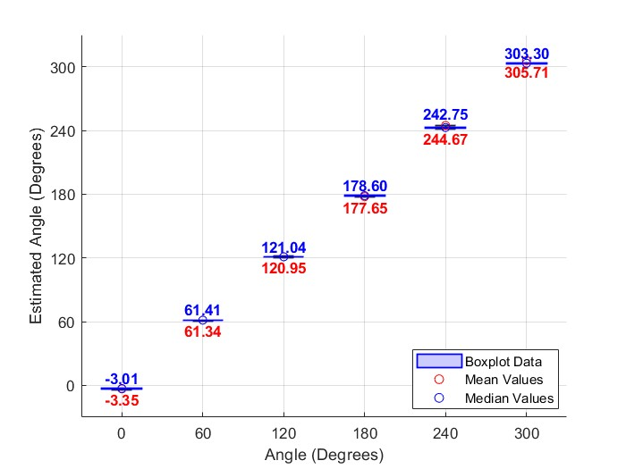
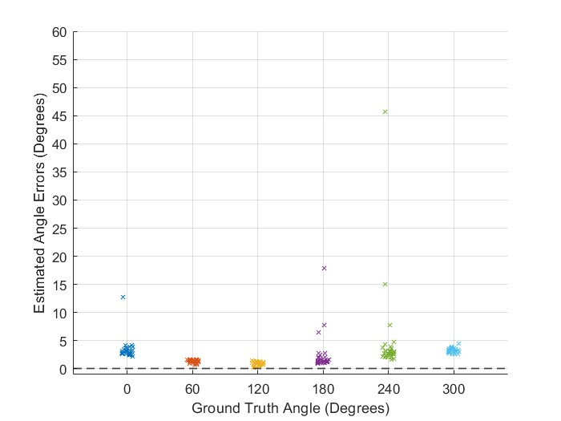

# Sensors_DroneDF Examples

Drone Angle-of-Arrival Estimation Using Switched-Beam Antenna and Single-Channel SDR
Overview
This repository contains MATLAB scripts and sample datasets for estimating the Angle-of-Arrival (AoA) of drone signals using a single-channel Software-Defined Radio (SDR) and a switched-beam antenna system. The system eliminates the need for a multi-channel receiver by time-division switching between six directional antennas.

Key Features:   
✅ Uses a single SDR for direction finding   
✅ Processes wideband, burst-mode OFDM signals   
✅ Handles UDP-based asynchronous switching for real-time processing   
✅ Applies a power-based estimation method for angle calculation   
✅ Provides visualization tools (Boxplots, Scatter plots) to analyze estimation errors   

0. Please download from the link : 

https://drive.google.com/file/d/1PB07MMl8r5h0GzDXGAFUk6oITfoGm47i/view?usp=sharing
https://drive.google.com/file/d/129WCWBmbbv_gtetFwnx8t8vkOO6htp47/view?usp=sharing


1. Data Structure & Configuration   
The system operates with six directional antennas arranged in a circular array. Each antenna captures RF signals using an SDR with the following configuration:

Sampling Rate: 10 MHz   
Switching Period (Tsw): 100 µs   
Samples per switch (SamplesPerSwitch): 10 MHz × 100 µs = 1000 samples   
📌 Antenna Data Configuration (Example for CW Signal)   

```[matlab]
antennaConfigs = {
    % AntennaNum, Ground Truth Angle (°), Filename, Time Shift
    1, 0, 'dataset_cwsingnal/ant1.mat', 10232;
    2, 60, 'dataset_cwsingnal/ant2.mat', 5957;
    3, 120, 'dataset_cwsingnal/ant3.mat', 1700;
    4, 180, 'dataset_cwsingnal/ant4.mat', 8361;
    5, 240, 'dataset_cwsingnal/ant5.mat', 10538;
    6, 300, 'dataset_cwsingnal/ant6.mat', 1015;
};
```
Each dataset (antX.mat) contains IQ samples collected at 10 MHz.   
The Time Shift parameter corrects timing offsets caused by UDP-based asynchronous switching.   

2. Data Synchronization & Processing   
🔹 Step 1: Load RF Data   
Each antenna’s IQ data is loaded, and signal magnitude is computed:   

```[matlab]
load(config.filename); % Load I1, Q1
Mag = I1.^2 + Q1.^2; % Compute power
```

🔹 Step 2: UDP Synchronization Correction   
Since UDP-based switching introduces timing drift, manual adjustments may be needed to ensure correct alignment:   

```[matlab]
Magslice = Mag(config.shift : sampling_index + config.shift - 1);
Magslice = reshape(Magslice, SamplesPerSegment, []);
```

🔹 Step 3: Angle Estimation Algorithm   
For each switching period, received power is aggregated, and angle is estimated:   

```[matlab]
Direction = zeros(6, index);
for i = 1:index
    for k = 1:6
        start_idx = (k-1) * RfConfigs.SamplesPerSwitch + 300;
        end_idx = (k-1) * RfConfigs.SamplesPerSwitch + (RfConfigs.SamplesPerSwitch - 300);
        Direction(k, i) = sum(Magslice(start_idx:end_idx, i));
    end
end
```
The direction vector is computed, and the estimated angle is extracted:   

```[matlab]
reA = Direction .* repmat(antenna_complex, 1, index);
reB = sum(reA);
estimated_angle = rad2deg(angle(reB(1:index)));
```
🔹 Step 4: Angle Adjustment for 240° and 300°
Due to circular array limitations, 240° and 300° angles require correction:

```[matlab]
estimated_angles(5, :) = estimated_angles(5, :) + 360;
estimated_angles(6, :) = estimated_angles(6, :) + 360;
```

3. Visualization & Analysis
📊 Figure 1: Boxplot of Estimated Angles
Boxplots are generated for each of the six antennas, with mean and median values highlighted:
```[matlab]
boxchart(filtered_x_groups, filtered_y_values, 'BoxFaceColor', 'blue');
scatter(1:num_antennas, mean_values, 30, 'r', 'filled'); % Mean values (Red)
scatter(1:num_antennas, median_values, 30, 'b', 'filled'); % Median values (Blue)
```
   
📈 Figure 2: Scatter Plot of Angle Errors   
This scatter plot visualizes angle errors across multiple test cases:   
```[matlab]
scatter(x_range, y_values, 20, colors(i, :), 'x');
```
   
📌 Goal: Observe error trends (e.g., packet loss causes larger errors).

4. How to Run the Code
🔹 Requirements
MATLAB (R2021a or later)
Dataset (.mat files)
Ensure MATLAB's Signal Processing Toolbox is installed
🔹 Steps
Clone this repository:
```[sh]
git clone https://github.com/your-repo/Drone-AoA-Estimation.git
cd Drone-AoA-Estimation
```

- Open MATLAB and navigate to the project folder.
- Download RF Data
- Run the main script: main.m
- Results will be displayed in Figure 1 & Figure 2.

5. Data Availability & License
The full raw RF dataset is large (10 MHz sampled data).   
Due to size limitations, a processed subset will be shared upon request.   
This repository follows the MIT License.   
📌 Next Steps   
 Refine UDP synchronization method   
 Improve angle interpolation accuracy   
 Optimize visualization scripts   
 Support real-time processing (future work)   

6. Contact   
For inquiries or data requests, please contact:   
📧 Han Sumin (hsm2005x@kookmin.ac.kr)   
📧 Prof. Byung-Jun Jang (bjjang@kookmin.ac.kr)   
